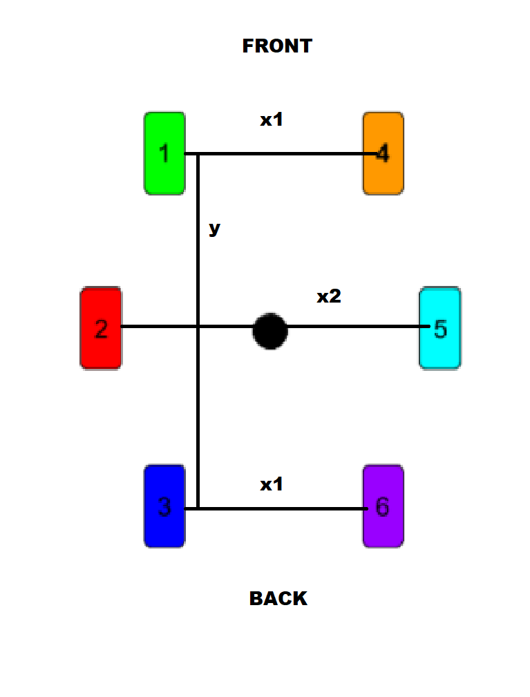
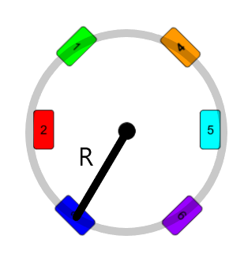

### Given Information

$$
x_1 = 310mm = 0.310m;
x_2 = 400mm = 0.40m;
y = 556mm = 0.556m;
$$

Encoder resolution = 0.04 degree per encoder count

We will denote $R$ as the distance from center rover to center of the circle that the rover travels along during its turn. In this case the center of the circle is roughly the center of the rover, but not exactly.

Each wheel will be turning to maximum angle which comes out to be roughly 43 degrees. This was found by knowing that the wheels lose 50 encoder counts on each side during calibration, to preserve the integrity of physical stops, and that the physical stops lie at about 45 degree turn.

(1)$$S = R \theta $$

First derivative of (1) is the velocity equation. Since $speed = \frac {distance}{time}$ we just make sure that all wheels travel the same distance in the same time of driving. Thus time is equal for each wheel so we will leave off the time denotion for velocity and also know that each wheel has a constant R radius to center so the arc length is a function of user input $\theta$.

Do note that the radii don't exactly line up. To actually line up with exact center we can do the following calculation.

$$
\theta = arctan(\frac {\frac {y}{2}}{\frac {x_1}{2}})
$$

$$
\theta = arctan(\frac {\frac {0.4m}{2}}{\frac {0.556}{2}}) = 60.86 \hspace{1mm} degrees
$$

This is physically impossible for our model but this is the caveat to our assumption of the wheels' radii center.

We can solve for the actual triangle by finding the height of the triangle using the definition of a tangent for triangles re-arranged a little. Then do Pythagorean Theorem with those values.

$$ tan(\theta) = \frac {opposite}{adjacent} $$

(2)$$\frac {x_1}{2} \hspace{1mm} * tan(\theta) = \frac {y'}{2} $$

$$\frac {0.31}{2} \hspace{1mm} * tan(43) = 0.145m $$

$$ R = \sqrt {(0.145m)^2 + (\frac {0.31m}{2})^2} = 0.2122m$$

Each wheel has the same radius, since they have the same dimensions and maximum turn angle.

We will hardcode the value of R for the calculation and move from time-based calculation from experimenting to a distance reliant approach using this arc length calculation.
